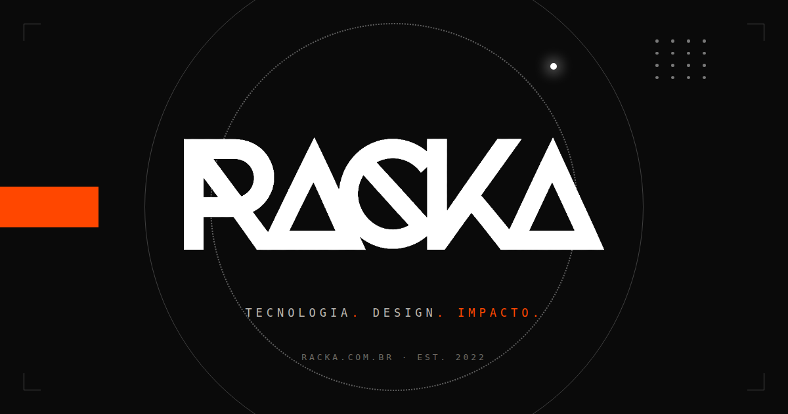

<div align="center">



# RACKA

**Tecnologia. Design. Impacto.**

Desenvolvemos soluções digitais disruptivas que conectam marcas, pessoas e futuros.

[racka.com.br](https://racka.com.br) · [hey@racka.com.br](mailto:hey@racka.com.br) · Curitiba, PR · Est. 2022

</div>

---

## Quem somos

A RACKA é um estúdio de tecnologia, design e estratégia. Unimos engenharia, design estratégico e visão de negócio para transformar ideias em produtos digitais que movem empresas de verdade — **19 anos de experiência somada, 26 especialistas multidisciplinares e mais de 50 projetos entregues**.

## O que fazemos

- **Design estratégico** — identidade, produto e experiência com propósito.
- **Desenvolvimento escalável** — engenharia moderna, pronta para crescer.
- **Dados e inteligência** — decisões guiadas por dados e IA.
- **Cloud & infraestrutura** — fundações sólidas, do deploy à operação.
- **Segurança e performance** — rápido, estável e confiável, sempre.

## Viela

Nosso produto próprio: **[Viela](https://viela.racka.com.br)** — comunidade, conexão e cultura em um só lugar. Descubra o melhor da sua cidade: pessoas, lugares, eventos e negócios locais.

## Vamos criar algo incrível juntos?

Fale com o time: **[hey@racka.com.br](mailto:hey@racka.com.br)** · +55 41 98827-9915

---

<details>
<summary><strong>Sobre este repositório</strong> (técnico)</summary>

Este é o código do site institucional [racka.com.br](https://racka.com.br) — estático, sem build e sem dependências: HTML + CSS + JavaScript vanilla, com fontes self-hosted e acessibilidade AA.

```
index.html            página única
css/style.css         sistema visual (tokens em DESIGN.md)
js/main.js            menu mobile, reveals, navegação ativa
assets/               logo, ícones, fontes, og-image
PRODUCT.md, DESIGN.md contexto de marca e design
```

**Rodar localmente**

```bash
python3 -m http.server 8000
# http://localhost:8000
```

**Publicação** — o workflow `.github/workflows/deploy.yml` publica no GitHub Pages a cada push na `main`, ativando o Pages e o domínio `racka.com.br` automaticamente. DNS (Cloudflare, modo *DNS only* até o HTTPS ativar):

| Tipo | Nome | Conteúdo |
|------|------|----------|
| A | `@` | 185.199.108.153 · 185.199.109.153 · 185.199.110.153 · 185.199.111.153 |
| CNAME | `www` | `rackalabs.github.io` |

**Pendências de conteúdo** — URLs dos perfis (Instagram, LinkedIn, Behance) no rodapé, marcadas com `TODO` no `index.html`.

</details>

<div align="center">
<sub>© 2026 RACKA. Todos os direitos reservados.</sub>
</div>
